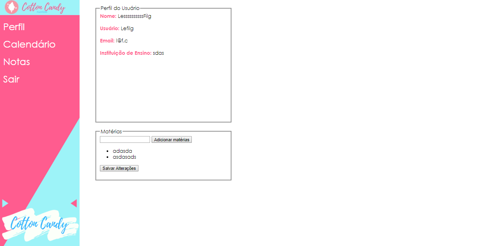
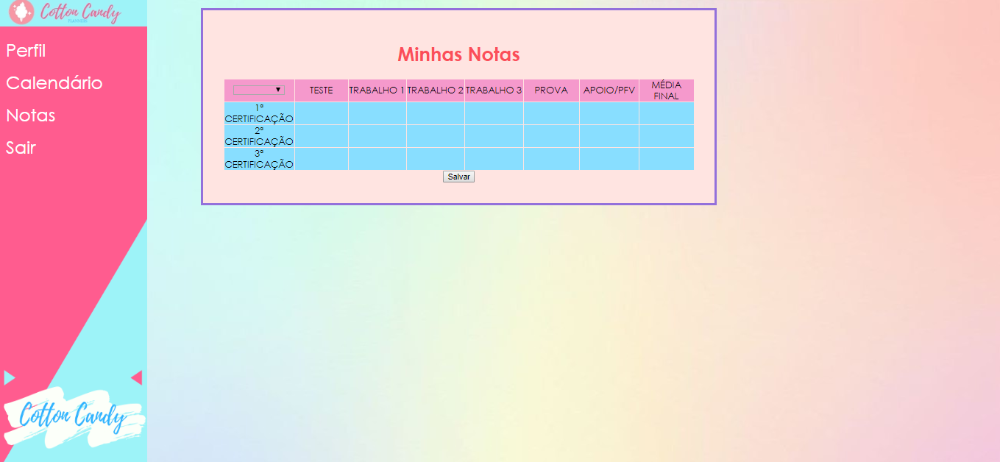
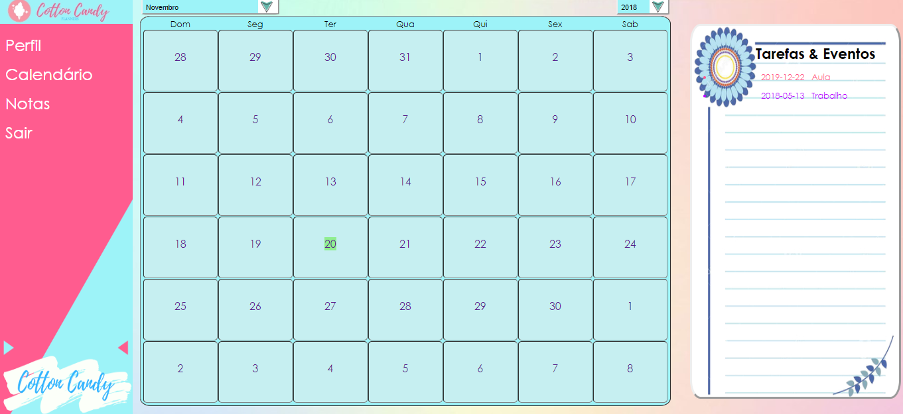

## Manual
*   
Na página inicial, o usuário pode se cadastrar preenchendoas informações solicitadascomo Nome, Sobrenome, Usuário,E-mail, Senha e Instituição de Ensino. Caso já seja cadastrado, poderá entrar colocando seu Usuário e a Senha.
*   
De acordo com os dados do usuário colocados no cadastro, eles aparecerão no perfil. Nessa página será possivel adicionar as matérias que ele cursa naquele ano.
 *   
 A página Notas é personalizado de acordo com as matérias e as notas de cada avaliação que o usuário dispor, calculando a média final de cada matéria.
*   
No calendário é possível marcar um evento ou tarefa, a hora e o local, além de disponibilizar ao lado os dias em que há eventos ou tarefas marcados.
